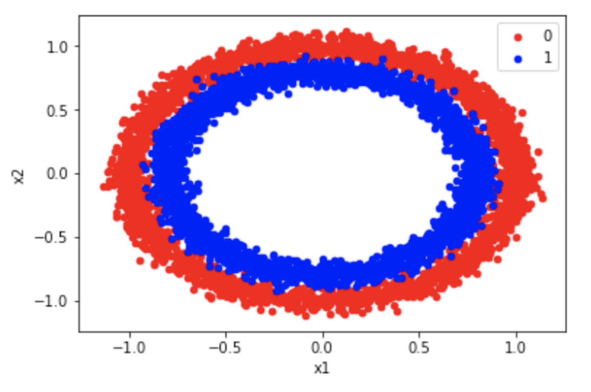

## 3.1 Multiple Linear Regression Prediction

1. Consider the following code, including the bais. How many parameters does the object model have?

```python
model=nn.Linear(4,1)
```

> 5

2. Consider the following code. How many rows and columns does the tensor yhat contain?

```python
X=torch.tensor([[1.0,1.0,1],[1.0,2.0,1],[1.0,3.0,1],[1.0,3.0,1]])
model=nn.Linear(3,1)
yhat=model(X)
```

- >4,1
- 3,1
- 4,4


3. If the input to our linear regression object is of 10 dimensions, including the bias, how many variables does our cost or total loss function contain?

>11

-------------

## 3.2 Multiple Output Linear Regression

1. What is true about the following lines of code?

```python
class linear_regression(nn.Module):
    def __init__(self,input_size,output_size):
        super(linear_regression,self).__init__()
        self.linear=nn.Linear(input_size,output_size)
    def forward(self,x):
        yhat=self.linear(x)
        return yhat
        
model=linear_regression(3,10)  
```

- The output of the model will have 10 rows
- >The output of the model will have 10 columns


2. What parameters do you have to change to the method backwards() when you train Multiple Output Linear Regression compared to regular Linear Regression?

- >None of them
- You have to specify the number of the output variables
- All of them

--------

## 3.3 Linear Classifiers

1. The following function is an example of:


- >logistic function
- threshold function

2. The logistic function can be interpreted as: 

- >Probability 
- integer value 

---------

## 3.4 Linear Classifiers

1. True or False? The following samples can be used for classifications for the variable y: 0,1.0,  0.11?

- incorrect 
- >True 

2. True or False the following dataset is linearly separable:



- >False 
- True 


----------

## 3.5 Logistic Regression: Prediction

1. What line of code is equivalent to: 

```python
model = nn.Sequential(nn.Linear(2, 1), nn.Sigmoid())
```
- >This
```python
class logistic_regression(nn.Module):
    
    # Constructor
    def __init__(self, n_inputs):
        super(logistic_regression, self).__init__()
        self.linear = nn.Linear(n_inputs, 1)
    
    # Prediction
    def forward(self, x):
        yhat = torch.sigmoid(self.linear(x))
```

- 
```python
 yhat = torch.sigmoid(self.linear(x))
```

2. How would you apply the sigmoid function to the tensor z 


```python
z=torch.arange(-100,100,0.1).view(-1, 1)
```

- >This
```python
sig=nn. Sigmoid ()
yhat=sig(z)
```

- >This
```python
yhat= torch.sigmoid(z)
```

--------

## 3.6 Bernoulli Distribution and Maximum Likelihood Estimation

1. An example of a Bernoulli Distributed variable is :


- >The face of a coin  after a flip 
- Height of a person  


2. The log likelihood function is given by

- $\Pi_{n=1}^N \theta^{y_n}(1-\theta)^{1-y_n}$
- >$\sum_{n=1}^N y_n \ln (\theta) + (1-y_n) \ln (1-\theta)$

---------

## 3.7 Logistic Regression Cross Entropy Loss

1. Whats the problem with obtaining the parameters for Logistic Regression and mean squared error     

- >during training, you may not reach the minimum of the cost surface     
- nothing, you should always use the mean squared error 


2. What is the PyTorch function you  would use for  training  Logistic regression with Cross Entropy .     

- >This
```python
nn.BCELoss()
```

-
```python
nn.MSELoss()
```
