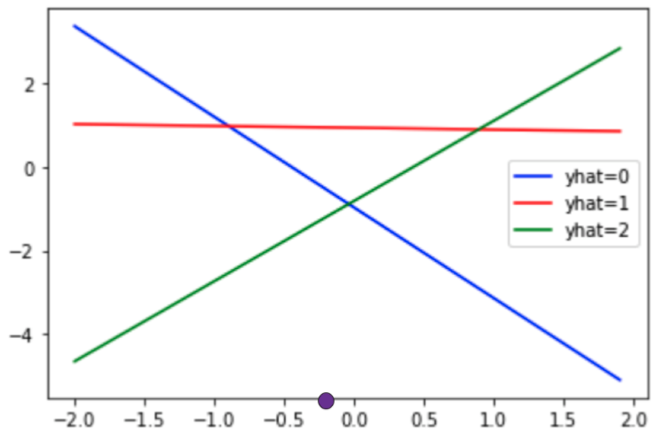
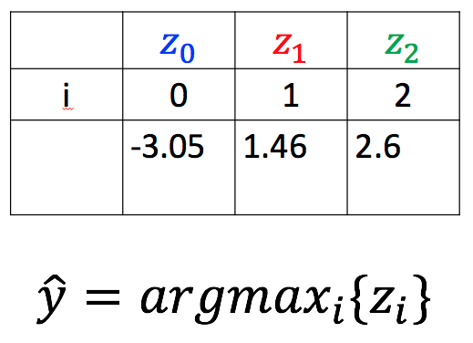
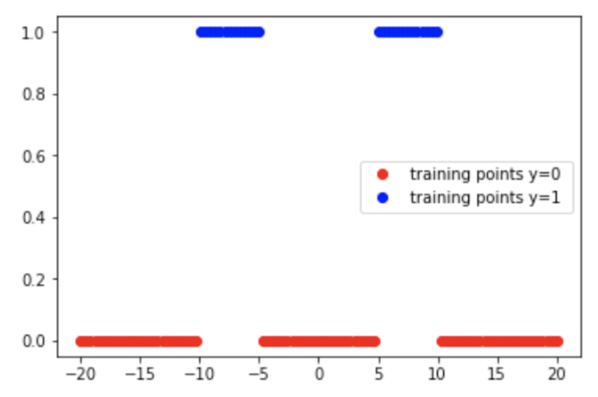
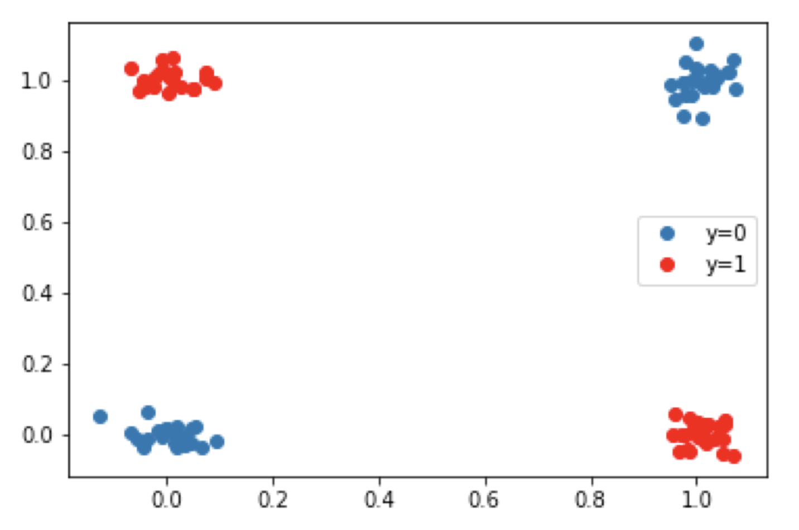

## Softmax Function

1. How would you classify the purple point given the three lines used in a softmax classifier:



- yhat=0 or blue
- >yhat=1 or red
- yhat=2 or green


2. Consider the following output of the lines used in the softmax function shown in the following table. What will be the value of yhat ?



- yhat=0
- yhat=1
- >yhat=2


## Softmax Prediction

1. Consider the following lines of code, what is yhat?

```python
    z = torch.tensor([[2,5,0],[10,8,2],[6,5,1]])
    _, yhat = z.max(1)
```

- >This
```python
tensor([1,0,0])
```
-
```python
tensor([5,10,5])
```

-
```python
tensor([1,1,1])
```

2. We have two input features and four classes , what are the parameters for Softmax() constructor according to the above code?

```python
class Softmax (nn.Module):

    def __init__(self, in_size, out_size):

        super(Softmax, self).__init__()

        self.linear=nn.Linear(in_size, out_size)

    def forward(self, x):
```

- Sofmax(4,2)
- >Sofmax(2,4)
- Sofmax(4,4)


## Softmax PyTorch Quizz

1. What is the task of the following line of code?

```python
    transforms.ToTensor()
```

- Delete a tensor
- Create a new tensor
- >Convert the image to a tensor


2. You have a 10x10 image and you would like to convert it to a vector or a rank one tensor, how many elements does it have?

> 100


## Neural Networks

1. Consider the following neural network model or class:

```python
class Net(nn.Module):
    def __init__(self,D_in,H,D_out):
        super(Net,self).__init__()
        self.linear1=nn.Linear(D_in,H)
        self.linear2=nn.Linear(H,D_out)


    def forward(self,x):
        x=torch.sigmoid(self.linear1(x))
        x=torch.sigmoid(self.linear2(x))
```

How many hidden neurons does the following neural network object have?

```python
    model=Net(1,6,1)
```

> 6

2. What's wrong with the following function :

```python
class Net(nn.Module):
    def __init__(self,D_in,H,D_out):
        super(Net,self).__init__()
        self.linear1=nn.Linear(D_in,H)
        self.linear2=nn.Linear(H,D_out)

    def forward(self,x):
        x=torch.sigmoid(linear1(x))
```

- nothing
- >you did not call self.linear1(x) and self .linear2(x)


## More Hidden Neurons

1. True or False, you can classify the following dataset with one hidden layer with two neurons.



- true
- >incorrect


2. A neural network with more hidden layers :

- has no advantages
- >can build a more complex decision function

## Neural Networks with Multiple Dimensional Inputs

1. True or False? The following dataset is linearly separable?



- >False
- Ture


2. How many dimensions is the input for the following neural network object:

```python
class Net(nn.Module):
    def __init__(self,D_in,H,D_out):
        super(Net,self).__init__()
        self.linear1=nn.Linear(D_in,H)
        self.linear2=nn.Linear(H,D_out)


    def forward(self,x):
        x=torch.sigmoid(self.linear1(x))
        x=torch.sigmoid(self.linear2(x))
```

> 4


## Multi-Class Neural Networks

1. Select the correct  cost function for a  Multi-Class Network network :

- >This
```python
    nn.CrossEntropyLoss()
```

-
```python
    nn.BCELoss()
```

2. True or false you can use  the following class or custom module to classify more than one class :

```python
class Net(nn.Module):
    def __init__(self,D_in,H,D_out):
        super(Net,self).__init__()
        self.linear1=nn.Linear(D_in,H)
        self.linear2=nn.Linear(H,D_out)

    def forward(self,x):
        x=torch.sigmoid(self.linear1(x))
        x=torch.sigmoid(self.linear2(x))
```

- false
- >true
