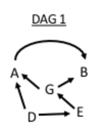

1. How many paths are there from D to B?


>Answer: 4
- $D \rightarrow A \rightarrow B$
- $D \rightarrow A \leftarrow G \rightarrow B$
- $D \rightarrow E \rightarrow G \rightarrow B$
- $D \rightarrow E \rightarrow G \rightarrow A \rightarrow B$


2. How many backdoor paths are there from G to B?


>Answer: 1
- $G \leftarrow E \leftarrow D \rightarrow A \rightarrow B$


3. Is G independent from D, given E?


>Answer: Yes


4. Is D independent from G?



>Answer: No


5. How many parents does B have?


- 0
- 1
- >2
- 3


6. (Assume we are interested in the causal effect of A on Y.)

How many backdoor paths are there from A to Y?


>Answer: 4

- $A \leftarrow B \rightarrow Y$
- $A \leftarrow B \rightarrow C \leftarrow G \rightarrow Y$
- $A \leftarrow G \rightarrow Y$
- $A \leftarrow G \rightarrow C \leftarrow B \rightarrow Y$


7. (Assume we are interested in the causal effect of A on Y.) How many unblocked backdoor paths are there from A to Y?


>Answer: 2 (all those who does not got through the collider on C)

- $A \leftarrow B \rightarrow Y$
- $A \leftarrow G \rightarrow Y$


8. (Assume we are interested in the causal effect of A on Y.) Conditioning on C creates a link between which two nodes?


- >B and G
- G and H
- C and A


9. (Assume we are interested in the causal effect of A on Y.) Does conditioning on {G,B} satisfy the backdoor path criterion?


- >Yes
- No

```
A set of variables X is sufficient to control for confounding if:

- it blocks all backdoor paths
- it does not include any descendants of treatment
```


10. (Assume we are interested in the causal effect of A on Y.) The set of variables to control for based on the disjunctive cause criterion is:


- {C,B,G,H}
- >{B,G,H}
- {G,H}
- {G,B}


11. (Assume we are interested in the causal effect of A on Y.) Does the set {C,B} satisfy the backdoor path criterion?


- Yes
- >No (it does not block backdoor path $A \leftarrow G \rightarrow Y$)

```
A set of variables X is sufficient to control for confounding if:

- it blocks all backdoor paths
- it does not include any descendants of treatment
```